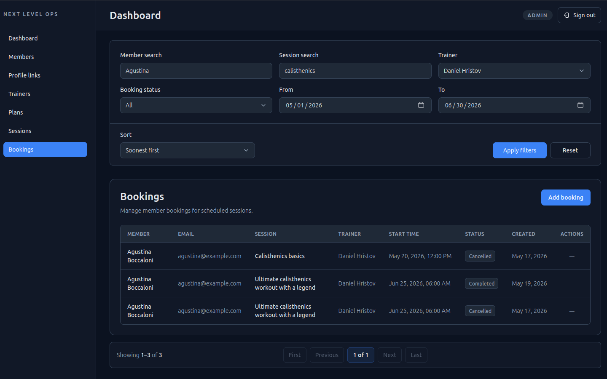

# Next Level Ops

Full-stack role-based operations dashboard for a fitness studio.

Next Level Ops helps studio staff manage members, trainers, membership plans, sessions, and bookings, while clients can view their linked member profile, active membership, upcoming bookings, booking history, and cancel eligible future bookings.

**Status:** MVP complete.

## Demo

- https://next-level-ops.vercel.app
- [Demo instructions](docs/demo.md)

## Screenshots

### Members operations


### Bookings operations



### Client cabinet


### Client booking cancellation


## Core features

### Admin

- Dashboard overview
- Members, trainers, membership plans, sessions, and bookings management
- Member membership assignment and cancellation
- Profile-to-member linking
- Booking creation and cancellation
- URL-driven search, filters, sorting, and pagination
- Derived operational statuses for sessions, bookings, and memberships

### Client

- Protected client cabinet
- Linked member profile and active membership
- Upcoming bookings and booking history
- Cancellation of own eligible future bookings

### Access control

- Role-protected admin and client areas
- Supabase Auth with RLS-backed data boundaries
- Admin-controlled profile-member linking
- Constrained RPCs for sensitive booking mutations

## Tech stack

- Next.js 16 App Router
- React 19
- TypeScript
- Supabase Auth / Postgres / RLS / RPC
- Tailwind CSS
- Zod
- Jest + React Testing Library
- Playwright

## Architecture

The application is server-first and keeps route orchestration, product behavior, and infrastructure concerns separated.

Key decisions:

- App Router pages stay thin and server-focused.
- Product logic lives in feature modules.
- Client components are limited to interactive UI.
- Auth users, app profiles, and studio members are separate concepts.
- Operational Members, Sessions, and Bookings screens use database-side filtering, exact counts, stable sorting, and pagination.
- Sensitive booking mutations are protected by database-backed invariants instead of UI-only checks.

Detailed documentation:

- [Architecture](docs/architecture.md)
- [Trade-offs](docs/trade-offs.md)
- [Testing strategy](docs/testing.md)
- [Decision log](docs/decision-log.md)
- [Roadmap](docs/post-mvp-roadmap.md)

## Testing

The project uses three levels of automated testing:

- **Jest** for domain and query logic
- **React Testing Library** for forms, filters, lists, validation, and interactive states
- **Playwright** for real Supabase-backed auth, access control, CRUD, booking, membership, profile-linking, discoverability, and navigation flows

The E2E suite runs against real Supabase infrastructure rather than a mocked backend.

Generated E2E data can be removed with:

```bash
npm run e2e:cleanup
```

See [Testing strategy](docs/testing.md) for environment requirements, fixture conventions, cleanup safety, and E2E details.

## Getting started

```bash
git clone <repository-url>
cd next-level-ops
npm install
```

Create `.env.local` from `.env.example` and provide the required Supabase credentials.

Then run:

```bash
npm run dev
```

Useful quality commands:

```bash
npm run quality
npm run e2e
npm run e2e:cleanup
```

Database schema changes are versioned in `supabase/migrations`.

## Current scope

The current product intentionally does not include:

- payments or Stripe
- client self-booking
- trainer portal
- advanced analytics
- automatic subscription lifecycle
- localization or theme switching

These are product boundaries, not hidden functionality. The reasoning behind the major compromises is documented in [Trade-offs](docs/trade-offs.md).
