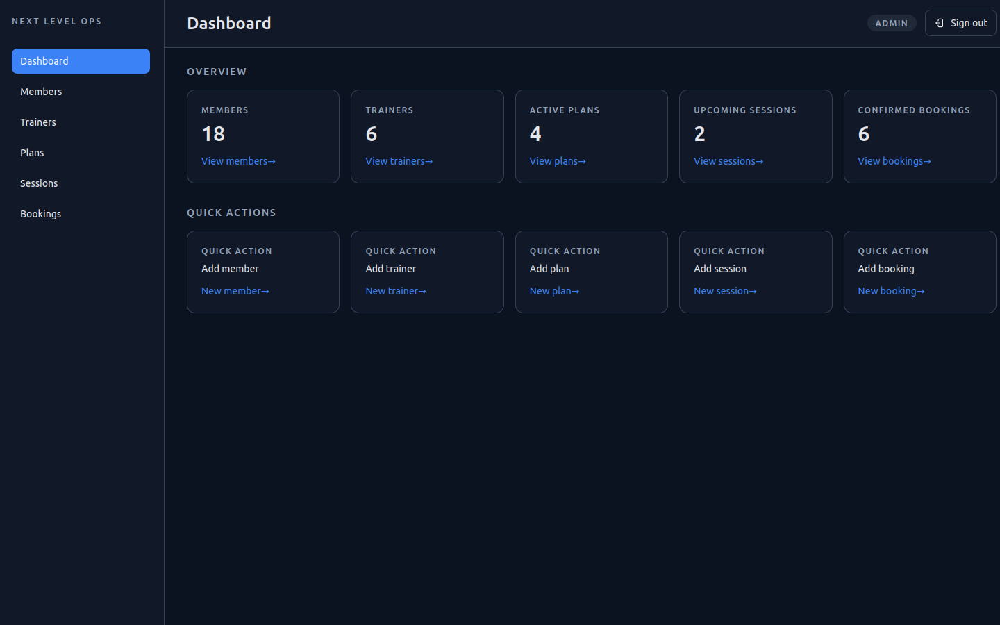
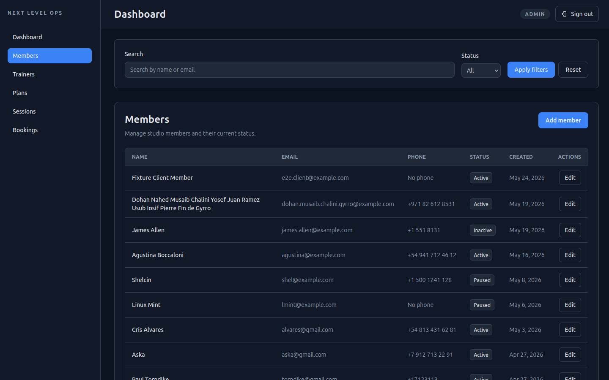
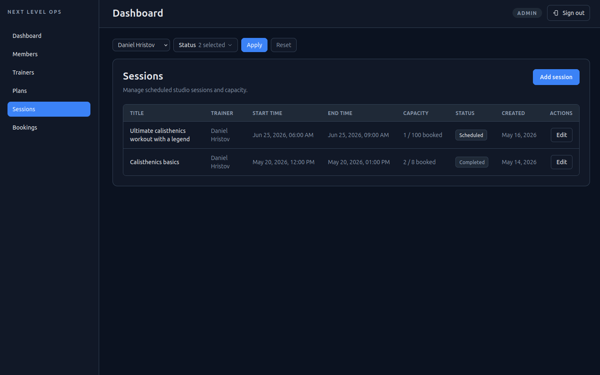
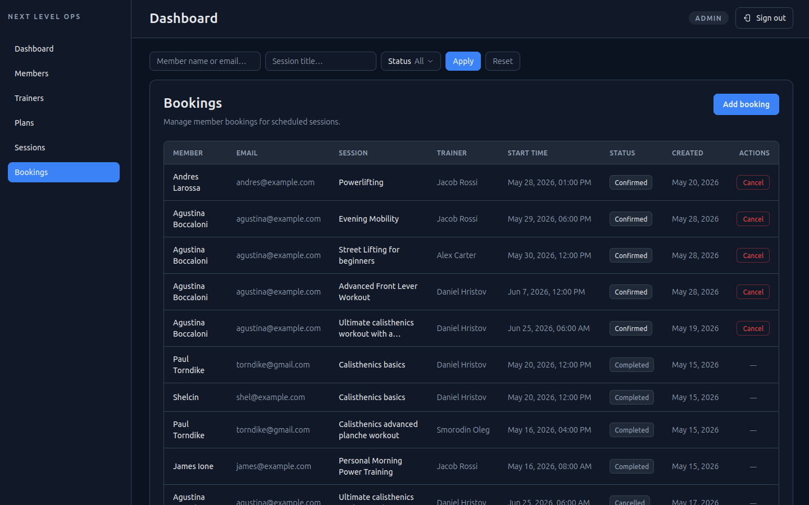
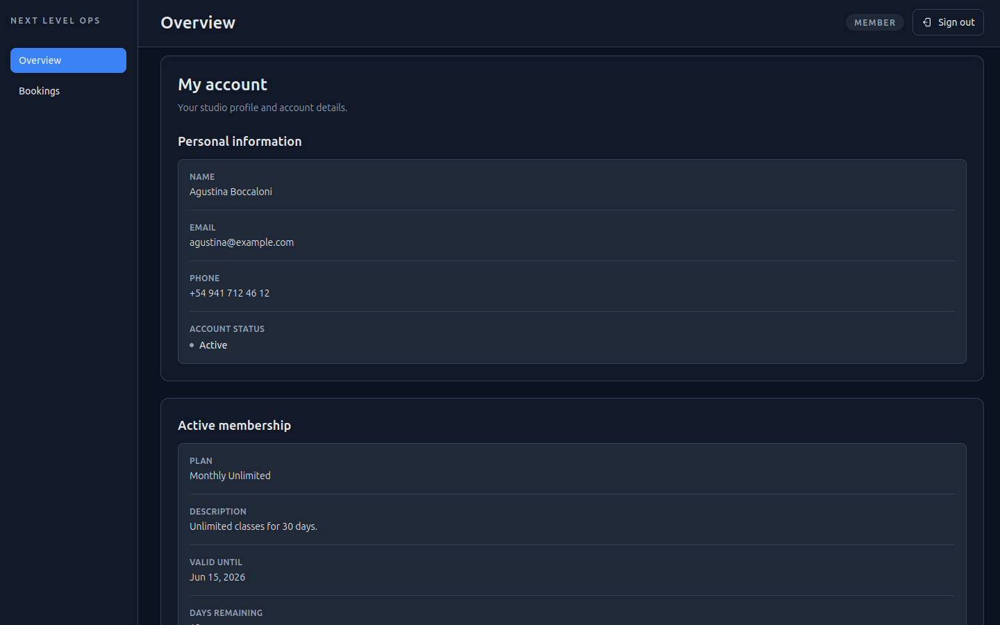
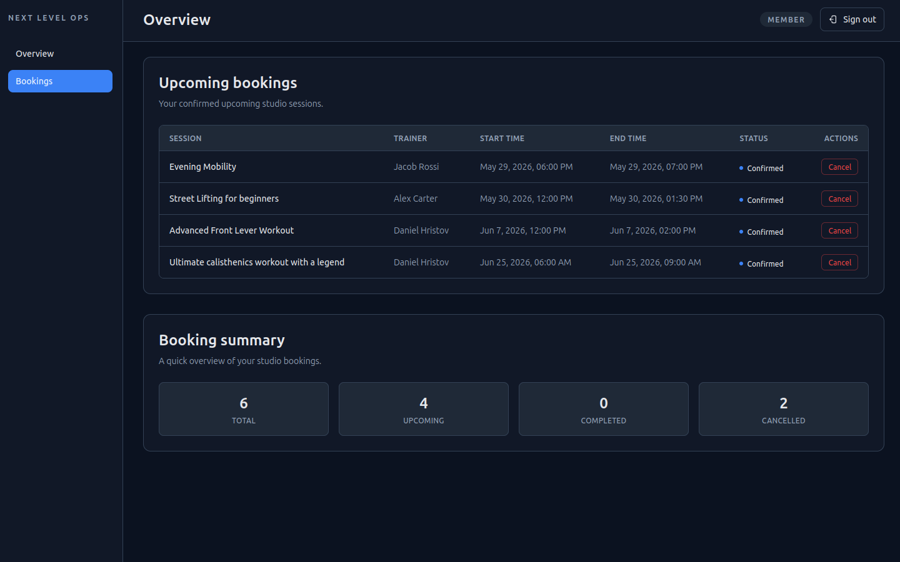
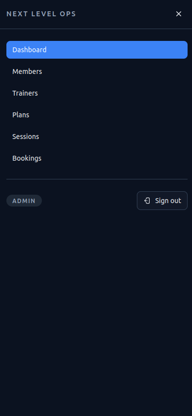

# Next Level Ops

Full-stack role-based operations dashboard for a fitness studio.

Next Level Ops helps studio staff manage members, trainers, membership plans, sessions, and bookings, while clients can use a limited cabinet to view their membership, upcoming bookings, booking history, and cancel their own future bookings.

> This is a production-shaped MVP focused on real operational workflows, role-based access, server-side data boundaries, forms, mutations, discoverability, and testing.

## Status

MVP complete.

Current focus: post-MVP hardening: access-control boundaries, business invariants, manual workflow reduction, operational scalability, performance/loading, and documentation alignment.

See the current roadmap:

- [Post-MVP Roadmap](docs/post-mvp-roadmap.md)

## Screenshots

### Admin dashboard overview



### Members screen



### Sessions discoverability



### Bookings discoverability



### Client cabinet overview



### Client bookings and cancellation



### Mobile navigation



## Demo

Hosted demo and local demo instructions:

- https://next-level-ops.vercel.app
- [Demo Instructions](docs/demo.md)

## Core features

### Admin

- Dashboard overview
- Members management
- Trainers management
- Membership plans management
- Sessions management
- Booking creation
- Booking cancellation
- Profile-member linking management
- URL-driven search and filters
- Operational sorting and derived statuses
- Responsive dashboard shell

### Client

- Protected client cabinet
- Linked member profile view
- Active membership overview
- Upcoming bookings
- Booking history summary
- Own future booking cancellation

### Access control

- Public auth routes
- Protected admin area
- Protected client area
- Role-aware root redirect
- Forbidden page for invalid role access
- Supabase RLS-backed data boundaries
- Admin-controlled profile-member linking through constrained RPCs
- RPC-based client cancellation flow

## Tech stack

- Next.js App Router
- React
- TypeScript
- Supabase Auth / Postgres / RLS / RPC
- Tailwind CSS
- Zod
- Jest
- React Testing Library
- Playwright
- ESLint
- Prettier

## Architecture highlights

The project uses a server-first Next.js App Router architecture.

High-level structure:

```txt
app/       routing, layouts, route-level server orchestration
features/  product flows and domain-specific UI/actions/model logic
widgets/   larger composition blocks such as admin/client shells
shared/    reusable UI, config, and generic helpers
lib/       infrastructure helpers such as Supabase clients
docs/      project decisions and architecture documentation
supabase/  database migrations
scripts/   project maintenance scripts
```

Important architecture decisions:

- `app` stays thin and route-focused.
- Feature modules own product behavior.
- Server actions handle mutations.
- Client components are used only for interactive UI.
- Auth users, app profiles, and studio members are separate concepts.
- Client profile-to-member linking is admin-controlled and handled through constrained RPCs.
- Route protection and database-level access control are treated as separate layers.
- Client booking cancellation is handled through a constrained database RPC instead of broad direct table updates.

More details:

- [Architecture Notes](docs/architecture.md)
- [Trade-offs](docs/trade-offs.md)
- [Testing Strategy](docs/testing.md)
- [Decision Log](docs/decision-log.md)

## Product model

The MVP has two authenticated roles:

### Admin

The admin manages operational studio data:

- members
- trainers
- membership plans
- sessions
- bookings

### Client

The client has a limited cabinet and can:

- view linked member information
- view active membership information
- view upcoming bookings
- view booking history summary
- cancel own confirmed future bookings

Client self-booking, payments, Stripe, trainer accounts, and full membership lifecycle automation are intentionally out of scope for the MVP.

## Testing

Testing is treated as an MVP quality gate, not as a 100% coverage target.

### Unit tests

Cover pure domain/model logic:

- derived booking statuses
- booking sorting
- derived session statuses
- session sorting
- status guards and helpers

### React Testing Library tests

Cover user-facing UI behavior:

- forms
- filters
- lists
- auth UI
- validation/action errors
- cancellation controls
- profile-member linking UI states

### Playwright E2E tests

Cover critical full-stack flows:

- auth and protected route access
- admin member create/edit/filter flow
- admin trainer/member/session/booking creation flow
- admin booking cancellation
- client cabinet access
- client own-booking cancellation
- sessions/bookings discoverability
- admin profile-member linking flow
- admin/client navigation smoke

Testing details:

- [Testing Strategy](docs/testing.md)

## Getting started

### 1. Clone the repository

```bash
git clone <repository-url>
cd next-level-ops
```

### 2. Install dependencies

```bash
npm install
```

### 3. Configure environment variables

Create `.env.local` based on `.env.example`.

Required for the app:

```bash
NEXT_PUBLIC_SUPABASE_URL=
NEXT_PUBLIC_SUPABASE_PUBLISHABLE_KEY=
```

Required for E2E tests:

```bash
E2E_ADMIN_EMAIL=
E2E_ADMIN_PASSWORD=
E2E_CLIENT_EMAIL=
E2E_CLIENT_PASSWORD=
```

### 4. Prepare Supabase

The project expects a Supabase project with the required schema, RLS policies, and RPC functions.

Database changes are versioned in:

```txt
supabase/migrations
```

Some MVP setup is manual:

- assign admin role
- prepare stable E2E fixtures if running Playwright tests

Client profile-to-member linking is handled from `/dashboard/profile-links` after admin access is configured.

### 5. Run the development server

```bash
npm run dev
```

Alternative Turbopack dev mode:

```bash
npm run dev:turbo
```

### 6. Run production build locally

```bash
npm run build
npm run start
```

## Scripts

```bash
npm run dev            # Start dev server with webpack
npm run dev:turbo      # Start dev server with Turbopack
npm run build          # Create production build
npm run start          # Start production server
npm run lint           # Run ESLint
npm run test           # Run Jest/RTL tests
npm run test:watch     # Run tests in watch mode
npm run test:coverage  # Generate coverage report
npm run e2e            # Run Playwright E2E tests
npm run e2e:ui         # Run Playwright UI mode
npm run quality        # Run lint, tests, and build
```

## E2E data

E2E tests use real Supabase-backed flows.

Conventions:

- `E2E ` prefix — records created by E2E tests
- `Fixture ` prefix — stable fixture records that should not be deleted

Manual cleanup script:

```txt
scripts/cleanup-e2e-data.sql
```

Run it from the Supabase SQL Editor when test data accumulates.

## MVP limitations

The MVP intentionally does not include:

- payments or Stripe integration
- client self-booking
- trainer portal
- advanced analytics
- automatic membership lifecycle automation
- light theme
- localization
- custom backend outside Supabase
- Dockerized local backend environment

These are documented as product and engineering trade-offs, not hidden missing features.

See:

- [Trade-offs](docs/trade-offs.md)

## Known performance note

The app currently depends on Supabase as a remote Backend-as-a-Service. Network latency and free-tier limits can affect response time, especially during development and E2E flows.

This is documented as a known trade-off and can be revisited if the project moves beyond MVP scope.

## Why this project matters

Next Level Ops demonstrates more than CRUD.

It shows:

- role-based product architecture
- protected routes
- server-first Next.js App Router usage
- Supabase Auth/RLS/RPC integration
- typed forms and mutations
- URL-driven discoverability
- secure profile-member linking flow
- secure cancellation flow
- responsive dashboard UX
- unit, RTL, and E2E testing strategy
- documented trade-offs and architecture decisions

The goal is to present a realistic full-stack frontend project with production-minded decisions, clear architecture, documented trade-offs, and tested critical flows.
